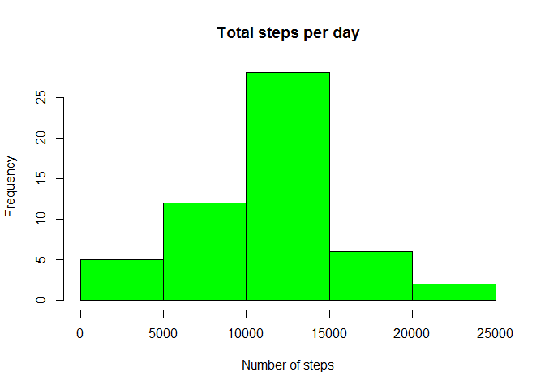
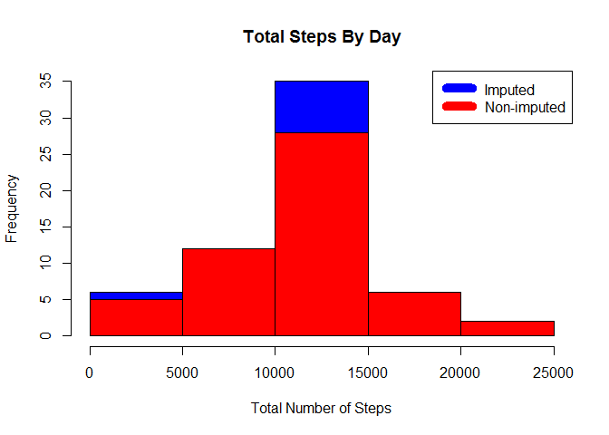

# Reproducible Research: Peer Assessment 1

## Loading and preprocessing the data

```r
activity <- read.csv("~/activity.csv", colClasses = c("numeric", "character", "numeric"))
```

## What is mean total number of steps taken per day?

First sum steps by day and create histogram.


```r
daily_steps <- aggregate (steps ~ date, data= activity, sum, na.rm=TRUE)
hist(daily_steps$steps, main = paste ("Total steps per day"), col="green", xlab="Number of steps")
```

 

Then calculate mean and median number of steps per day...


```r
mean_steps <- mean(daily_steps$steps)
mean_steps
```

```
## [1] 10766.19
```

```r
median_steps <- median(daily_steps$steps)
median_steps
```

```
## [1] 10765
```

## What is the average daily activity pattern?

```r
steps_by_interval <- aggregate(steps ~ interval, data= activity, mean)

plot(steps_by_interval$interval,steps_by_interval$steps, type="l", xlab="Interval", ylab="Number of Steps",main="Average Number of Steps per Day by Interval")
```

 

Which 5-minute interval, on average across all the days in the dataset, contains the maximum number of steps?


```r
max_interval <- steps_by_interval[which.max(steps_by_interval$steps),1]
```
## Imputing missing values
Determine number of rows with missing values

```r
activity_NAS <- sum (!complete.cases(activity))
activity_NAS
```

```
## [1] 2304
```

Imputing missing values with average of corresponding interval

```r
imputed_Vals <- transform(activity, steps = ifelse(is.na(activity$steps), steps_by_interval$steps[match(activity$interval, steps_by_interval$interval)], activity$steps))
```

Particular treatment for 10-01-2012. missing value was replaced by 0 to avoid discrepancies with following days

```r
imputed_Vals[as.character(imputed_Vals$date) == "2012-10-01", 1] <- 0
```

Recount total steps per day and create histogram

```r
daily_steps2 <- aggregate(steps ~ date, imputed_Vals, sum)
hist(daily_steps2$steps, main = paste("Total Steps By Day"), col="blue", xlab="Total Number of Steps")

#Create Histogram to show difference. 
hist(daily_steps$steps, main = paste("Total Steps By Day"), col="red", xlab="Total Number of Steps", add=T)
legend("topright", c("Imputed", "Non-imputed"), col=c("blue", "red"), lwd=10)
```

 

compute new mean and median from imputed data


```r
new_mean <- mean(daily_steps2$steps)
new_mean
```

```
## [1] 10589.69
```

```r
new_median <- median(daily_steps2$steps)
new_median
```

```
## [1] 10766.19
```

Calculate difference between non-imputed and imputed data

```r
mean_diff <- new_mean - mean_steps
format(mean_diff, digits=2, nsmall=2)
```

```
## [1] "-176.49"
```

```r
med_diff <- new_median - median_steps
format(med_diff, digits=2, nsmall=2)
```

```
## [1] "1.19"
```

Compute total difference

```r
total_diff <- sum (daily_steps2$steps)- sum (daily_steps$steps)
```

 
+ The imputed data mean is 1.0589694\times 10^{4}

+ The imputed data median is 1.0766189\times 10^{4}

+ The difference between the imputed and non-imputed mean is -176.4948964

+ The difference between the imputed and non-imputed median is 1.1886792

+ The difference between the total number of steps in imputed and non imputed data is 7.5363321\times 10^{4}.


## Are there differences in activity patterns between weekdays and weekends?

Create plot to visualize patterns of activity for weekdays and weekends


```r
weekdays <- c("Monday", "Tuesday", "Friday", "Wednesday", "Thursday", "Friday")

imputed_Vals$dow = as.factor(ifelse(is.element(weekdays(as.Date(imputed_Vals$date)),weekdays), "Weekday", "Weekend"))

steps_by_intervals <- aggregate(steps ~ interval + dow, imputed_Vals, mean)

library(lattice)

xyplot(steps_by_intervals$steps ~ steps_by_intervals$interval|steps_by_intervals$dow, main="Average Steps per Day by Interval",xlab="Interval", ylab="Steps",layout=c(1,2), type="l")
```

 

